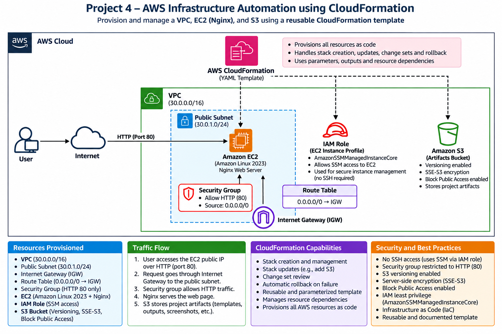
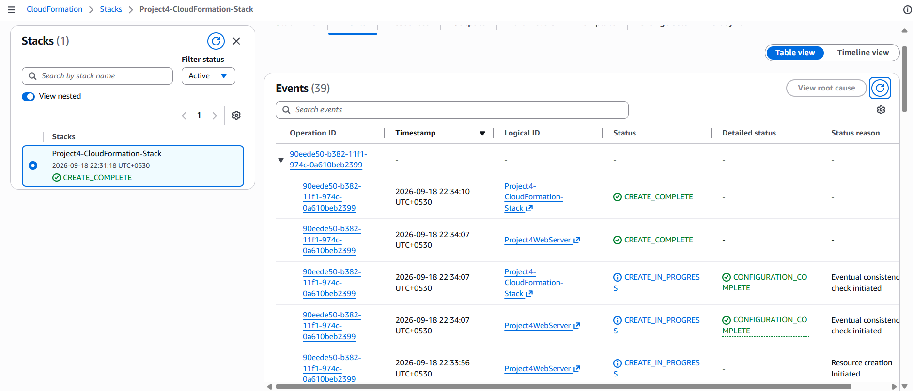
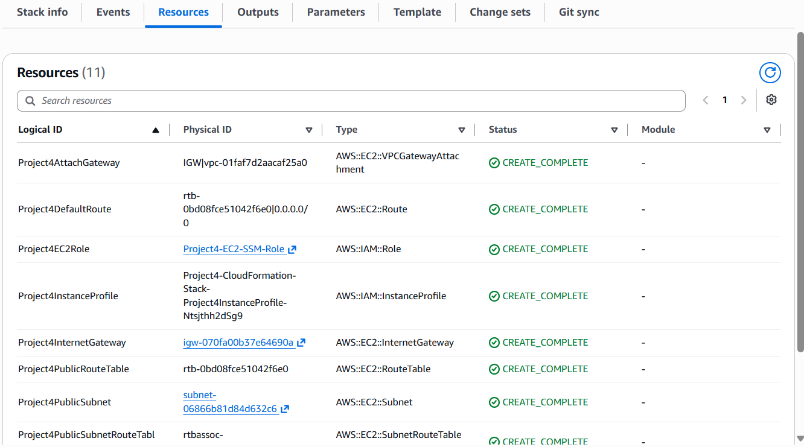
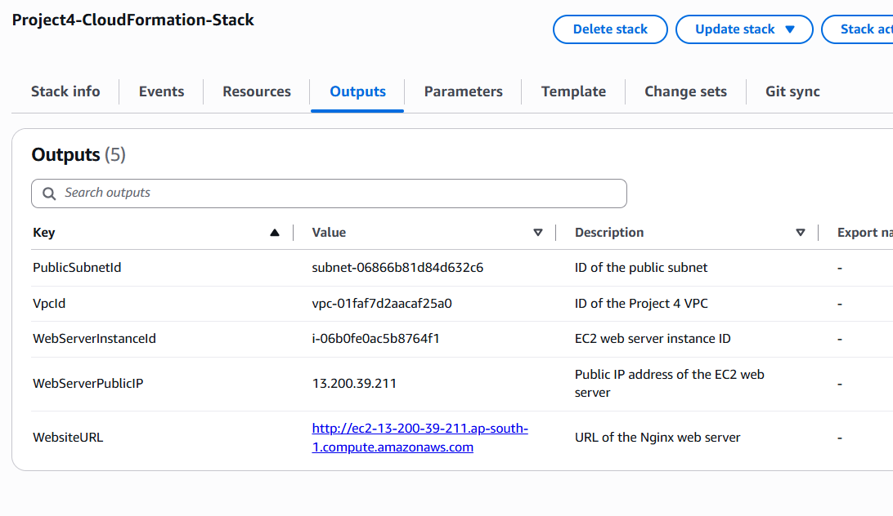
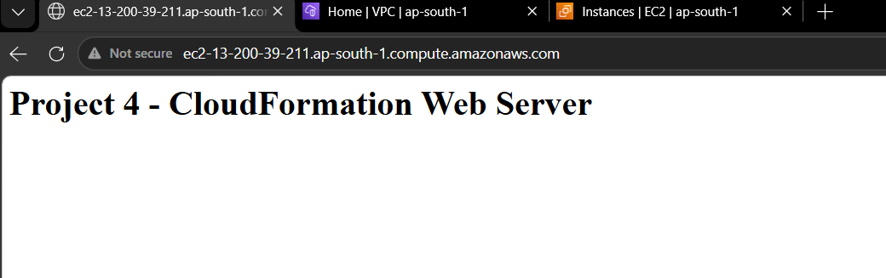
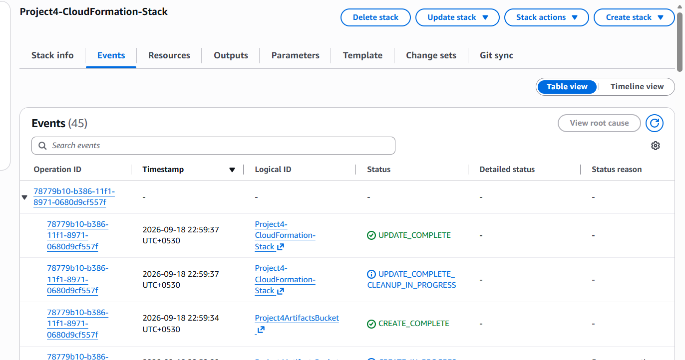
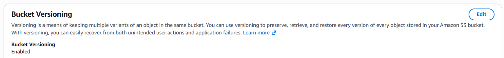
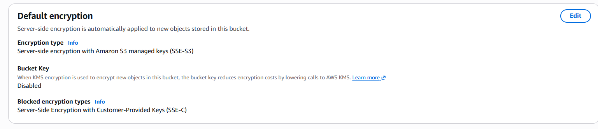
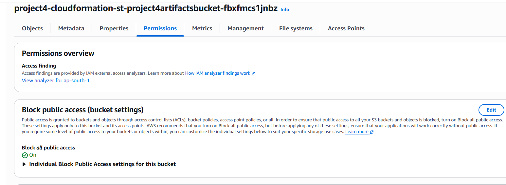

# AWS Infrastructure Automation using CloudFormation

## Project Overview

This project demonstrates Infrastructure as Code (IaC) using AWS CloudFormation to provision and manage AWS infrastructure through a reusable YAML template.

The stack provisions a custom VPC, public subnet, Internet Gateway, route table, security group, IAM role and instance profile, EC2 web server, and an S3 artifacts bucket.

The project also demonstrates stack creation, stack updates, CloudFormation change-set review, controlled update failure, automatic rollback, troubleshooting, and recovery.

## Architecture Diagram

The diagram below shows the AWS infrastructure provisioned and managed using the CloudFormation template.



## Architecture Components

- **Amazon VPC** — Custom VPC (`30.0.0.0/16`) for the project infrastructure.
- **Public Subnet** — Hosts the EC2 web server with public internet connectivity.
- **Internet Gateway** — Provides internet connectivity for resources in the public subnet.
- **Route Table** — Routes internet-bound traffic (`0.0.0.0/0`) through the Internet Gateway.
- **Security Group** — Allows HTTP traffic on port 80 to the web server.
- **Amazon EC2** — Runs an Amazon Linux 2023 instance with Nginx installed automatically through User Data.
- **IAM Role & Instance Profile** — Provides the EC2 instance with AWS Systems Manager permissions.
- **Amazon S3** — Artifacts bucket with versioning, SSE-S3 encryption, and Block Public Access enabled.
- **AWS CloudFormation** — Provisions and manages the infrastructure from the YAML template.

## Deployment and Stack Update

The infrastructure was initially deployed as a CloudFormation stack using a YAML template.

The initial deployment created the networking, security, IAM, and EC2 resources. Nginx was installed and started automatically using EC2 User Data, and the web server was successfully accessed through its public DNS name.

The stack was later updated through CloudFormation to add an S3 artifacts bucket. Before applying the update, the CloudFormation change set was reviewed to verify the planned infrastructure changes.

The S3 bucket was configured with:

- Versioning enabled
- SSE-S3 encryption
- Block Public Access enabled

The stack successfully reached `UPDATE_COMPLETE` after the S3 update.

## CloudFormation Rollback and Troubleshooting

A controlled stack update failure was performed to test CloudFormation rollback behavior.

A temporary EC2 resource with an intentionally invalid AMI ID was introduced. Before executing the update, the CloudFormation change set was reviewed to ensure the existing web server would not be replaced.

During the update:

- The temporary EC2 resource failed to create.
- CloudFormation entered `UPDATE_ROLLBACK_IN_PROGRESS`.
- The failed temporary resource was automatically removed.
- The stack successfully reached `UPDATE_ROLLBACK_COMPLETE`.
- The original EC2 web server, S3 bucket, networking, and IAM resources remained intact.

The CloudFormation Events tab was used to investigate the failure and verify the rollback process.

For detailed troubleshooting steps and evidence, see [CloudFormation Rollback Test](documentation/cloudformation-rollback-test.md).

## Project Evidence

### CloudFormation Stack Creation


### CloudFormation Resources


### Stack Outputs


### Nginx Web Server


### S3 Stack Update


### S3 Versioning


### S3 Encryption


### S3 Block Public Access


### CloudFormation Rollback


## Key Learnings

- Automated AWS infrastructure provisioning using CloudFormation YAML.
- Used parameters, references, outputs, and resource dependencies to build a reusable template.
- Provisioned VPC networking, security groups, IAM, EC2, and S3 through Infrastructure as Code.
- Automated Nginx installation and configuration using EC2 User Data.
- Performed a CloudFormation stack update to add new infrastructure.
- Reviewed change sets before applying infrastructure changes.
- Troubleshot CloudFormation update failures using stack Events.
- Tested automatic rollback and verified recovery of the previous working stack state.
- Applied S3 security controls including versioning, SSE-S3 encryption, and Block Public Access.

## Repository Structure

```text
aws-cloudformation-infrastructure-automation/
├── README.md
├── templates/
│   └── project4-infrastructure.yaml
├── documentation/
│   └── cloudformation-rollback-test.md
└── screenshots/
    └── Project deployment, S3, and rollback evidence

```

## Project Status
- Infrastructure deployment: Complete
- EC2/Nginx validation: Complete
- S3 stack update: Complete
- S3 security configuration verification: Complete
- CloudFormation rollback testing: Complete
- Troubleshooting and recovery verification: Complete
