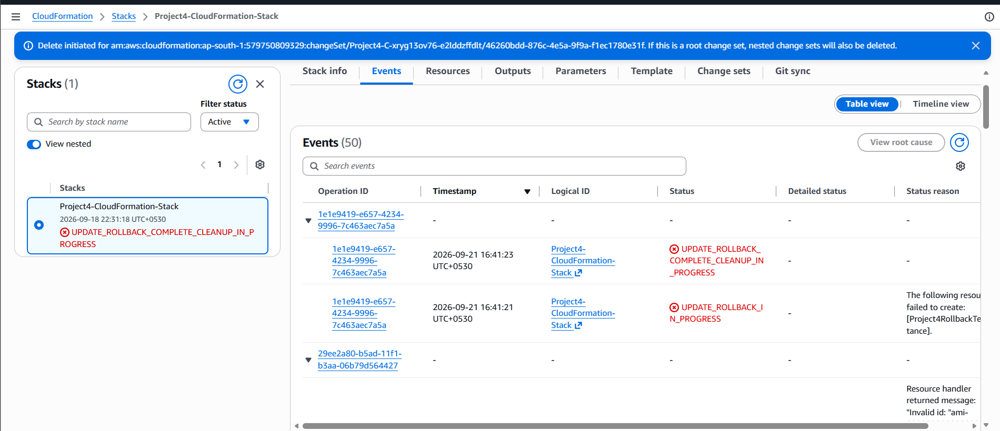
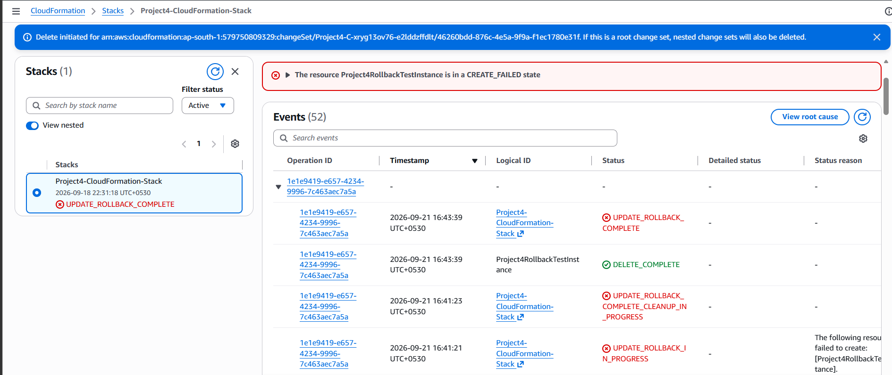
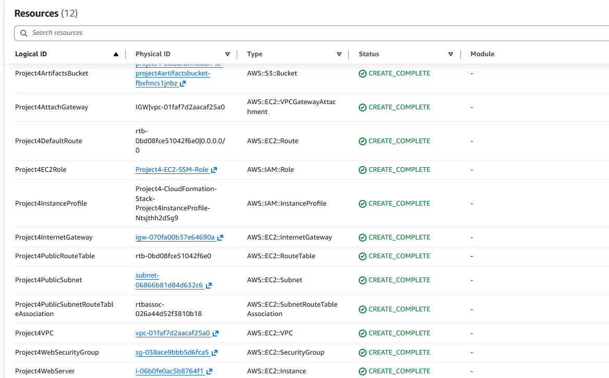

# CloudFormation Update Failure and Rollback Test

## Scenario

A controlled CloudFormation update failure was performed to test stack rollback behavior and verify that the existing infrastructure remained available after an unsuccessful update.

A temporary EC2 resource was added to the template with an intentionally invalid AMI ID. The goal was to observe how CloudFormation handles a resource creation failure during a stack update.

## Failure Observed

During the stack update, CloudFormation attempted to create the temporary EC2 instance but the resource creation failed because the specified AMI ID was invalid.

CloudFormation then automatically started the update rollback process.

The stack transitioned through:

- `UPDATE_ROLLBACK_IN_PROGRESS`
- `UPDATE_ROLLBACK_COMPLETE_CLEANUP_IN_PROGRESS`
- `UPDATE_ROLLBACK_COMPLETE`

The failed temporary EC2 resource was automatically removed during rollback.

## Investigation and Root Cause

The CloudFormation Events tab was reviewed to identify the failed resource and determine why the update entered rollback.

The temporary EC2 resource failed because it referenced an intentionally invalid AMI ID. This demonstrated how CloudFormation reports resource-level failures and automatically protects the previous working stack state through rollback.

Before executing the test, the CloudFormation change set was also reviewed to ensure that the existing web server would not be replaced unintentionally.

## Recovery and Verification

CloudFormation automatically rolled the failed update back to the previous working stack state.

After rollback completed:

- The stack reached `UPDATE_ROLLBACK_COMPLETE`.
- The failed temporary EC2 resource was removed.
- The original EC2 web server remained intact.
- The S3 artifacts bucket remained intact.
- Existing networking, IAM, and other stack resources remained available.

The temporary rollback-test resource was then removed from the local CloudFormation template, restoring the template to its clean final configuration.

## Key Learnings

- CloudFormation change sets should be reviewed before executing updates.
- Resource creation failures can trigger automatic stack rollback.
- Rollback helps preserve the previously working infrastructure state.
- CloudFormation Events are useful for identifying failed resources and troubleshooting stack operations.
- Infrastructure templates should be restored to a clean state after controlled testing.

## Screenshots

### Update Rollback

### Rollback Complete

### Resources After Rollback

